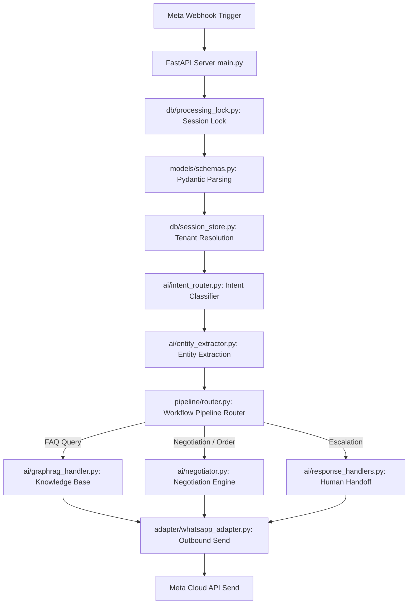

# WhatsApp AI Operations Platform for SMBs (whatsapp-bot)

A multi-tenant WhatsApp AI agent platform built with **FastAPI**, **Streamlit**, and **Supabase (PostgreSQL)**. It features intent classification, dynamic prompt management, a custom price negotiation engine, GraphRAG product lookups, and persistent memory.

---

## 📖 Architecture & Data Flow

When a WhatsApp message is received from a customer, it goes through the following lifecycle:



### End-to-End Processing Steps:
1. **Webhook Handler**: FastAPI in [main.py](file:///c:/Users/gudal/Downloads/whatsapp-bot/whatsapp-bot/main.py) receives a `POST` webhook from Meta's WhatsApp Cloud API containing customer message events.
2. **Race-Condition Locking**: [processing_lock.py](file:///c:/Users/gudal/Downloads/whatsapp-bot/whatsapp-bot/db/processing_lock.py) locks the session key so that rapid sequential messages from the same user are queued and processed safely.
3. **Data Parsing**: Incoming payloads are mapped to structured Pydantic models defined in [schemas.py](file:///c:/Users/gudal/Downloads/whatsapp-bot/whatsapp-bot/models/schemas.py).
4. **Tenant Check**: The database resolves the `tenant_id` corresponding to the incoming recipient phone number using [session_store.py](file:///c:/Users/gudal/Downloads/whatsapp-bot/whatsapp-bot/db/session_store.py).
5. **Intent Classification**: [intent_router.py](file:///c:/Users/gudal/Downloads/whatsapp-bot/whatsapp-bot/ai/intent_router.py) uses Azure OpenAI to classify user intent (`WORKFLOW_ACTION`, `FAQ_KNOWLEDGE`, `HUMAN_ESCALATION`, `GREETING`, `UNKNOWN`).
6. **Workflow Routing**: [pipeline/router.py](file:///c:/Users/gudal/Downloads/whatsapp-bot/whatsapp-bot/pipeline/router.py) maps the intent to the correct handler:
   * **Product & Order Queries**: Answers product specs using [product_followup.py](file:///c:/Users/gudal/Downloads/whatsapp-bot/whatsapp-bot/ai/product_followup.py) and negotiates discounts using the margin-safe algorithm in [negotiator.py](file:///c:/Users/gudal/Downloads/whatsapp-bot/whatsapp-bot/ai/negotiator.py).
   * **Knowledge/FAQs**: Queries the external GraphRAG API using [graphrag_handler.py](file:///c:/Users/gudal/Downloads/whatsapp-bot/whatsapp-bot/ai/graphrag_handler.py).
7. **Message Send**: [whatsapp_adapter.py](file:///c:/Users/gudal/Downloads/whatsapp-bot/whatsapp-bot/adapter/whatsapp_adapter.py) issues standard/interactive messages back to the customer's WhatsApp app.

---

## ⚙️ How the Code Works (Under the Hood)

This section explains the code implementation details for each stage of the message pipeline:

### 1. Webhook Entry & Lock Check (`main.py` + `db/processing_lock.py`)
*   When Meta invokes `POST /webhook`, the server immediately returns a `200 OK` status to WhatsApp to avoid timeouts. The message is handled asynchronously using an `asyncio.create_task()` worker.
*   The worker retrieves a semaphore lock (`acquire_lock` in `processing_lock.py`) using PostgreSQL. This prevents a customer from triggering duplicate AI responses if they double-tap a button or send several messages back-to-back.

### 2. Intent Classification & Entity Extraction (`ai/`)
*   **Intent Router**: `intent_router.py` makes a call to Azure OpenAI GPT-4. It passes the customer's message, current workflow history, and a few-shot list of examples to classify their intent into one of the `VALID_INTENTS` categories.
*   **Entity Extractor**: If the intent is related to buying or queries, `entity_extractor.py` parses the message to find parameters like quantities, size/specs, SKU format, and delivery preferences, converting free-form language into a structured JSON dictionary.

### 3. State Management & Workflow Sessions (`db/` + `pipeline/`)
*   The conversation context is stored in `workflow_sessions` tables. 
*   `db/workflow_state.py` manages the active state of the user. For instance:
    *   `START` $\rightarrow$ `GREETING`
    *   `BROWSING` $\rightarrow$ User is looking at products.
    *   `NEGOTIATING` $\rightarrow$ User has requested a custom discount on a product.
    *   `CHECKOUT` $\rightarrow$ Order details confirmed, invoice generated.

### 4. Custom Pricing & Negotiation Engine (`ai/negotiator.py`)
*   The negotiation algorithm computes whether the customer's requested discount lies above the minimum company threshold margin.
*   If the price is too low, the algorithm calculates a counter-offer that drops sequentially over multiple turns (e.g., offering 5% off, then 8% off, up to the maximum allowance).
*   If the deal is accepted, the state shifts to Checkout, where `utils/invoice.py` compiles a PDF invoice containing product line items, hardcoded tax rates, and a UPI QR payment code.

### 5. Outbound WhatsApp Adapter (`adapter/whatsapp_adapter.py`)
*   Instead of plain text, the bot leverages Meta's interactive features:
    *   **List Messages**: Shows list selectors for products or catalog pages.
    *   **Reply Buttons**: Quick-action buttons (e.g., "Confirm Order", "Talk to Agent", "Cancel").
    *   **Media Templates**: Sends PDFs (like generated invoices) directly to the user's chat window.

---

## 📂 Project Directory Structure

*   [main.py](file:///c:/Users/gudal/Downloads/whatsapp-bot/whatsapp-bot/main.py): FastAPI backend routes, server startup, and main webhook entry points.
*   **`adapter/`**: Low-level HTTP helper routines to push messages, list options, and interactive media templates to Meta's endpoints.
*   **`ai/`**: Cognitive modules and prompts:
    *   [intent_router.py](file:///c:/Users/gudal/Downloads/whatsapp-bot/whatsapp-bot/ai/intent_router.py) (intent determination)
    *   [entity_extractor.py](file:///c:/Users/gudal/Downloads/whatsapp-bot/whatsapp-bot/ai/entity_extractor.py) (slots/entities parsing)
    *   [negotiator.py](file:///c:/Users/gudal/Downloads/whatsapp-bot/whatsapp-bot/ai/negotiator.py) (interactive pricing discount manager)
    *   [product_followup.py](file:///c:/Users/gudal/Downloads/whatsapp-bot/whatsapp-bot/ai/product_followup.py) (product spec queries)
*   **`db/`**: Supabase/PostgreSQL database interfaces for message caches, session locks, and prompt configs.
*   **`interface/`**: Streamlit dashboard app files for managing prompts, seeing order pipelines, and verifying system health.
*   **`models/`**: Unified Pydantic type signatures for request payloads.
*   **`pipeline/`**: Step-based message flow handlers and routers.
*   **`utils/`**: Utilities for alert systems, PDF rendering, and GST invoice creation.

---

## 🛠️ Local Development & Launching

1. **Install Dependencies**:
   ```bash
   pip install -r requirements.txt
   ```
2. **Environment Variables**:
   Create a local `.env` file containing database connections, Azure OpenAI endpoints, and WhatsApp tokens:
   ```ini
   SUPABASE_URL="..."
   SUPABASE_SERVICE_KEY="..."
   AZURE_OPENAI_API_KEY="..."
   AZURE_OPENAI_ENDPOINT="..."
   WHATSAPP_ACCESS_TOKEN="..."
   ```
3. **Launch Backend (FastAPI)**:
   ```bash
   uvicorn main:app --reload --port 8000
   ```
4. **Launch Dashboard (Streamlit)**:
   ```bash
   streamlit run interface/app.py --server.port 8502
   ```

---

## ⚠️ Known Gaps & Unsolved Roadmaps

The current codebase is in transition to becoming a true multi-tenant SaaS. Below are the key architectural items that remain **unsolved** or require refactoring:

1. **Single-Tenant Hardcoding**:
   * Global singletons in [config.py](file:///c:/Users/gudal/Downloads/whatsapp-bot/whatsapp-bot/config.py) lock the system to a single WhatsApp Sender Number, a single `PRODUCTS_API_URL`, and `GRAPHRAG_API_URL` endpoint.
   * [intent_router.py](file:///c:/Users/gudal/Downloads/whatsapp-bot/whatsapp-bot/ai/intent_router.py) prompts are frozen at import time with LED lighting examples, meaning non-retail tenants get misclassified intents.
2. **Billing & Tax Rules**:
   * GST is hardcoded at 18% in [product_store.py](file:///c:/Users/gudal/Downloads/whatsapp-bot/whatsapp-bot/db/product_store.py) and invoice templates, bypassing configured tenant tax rules. There is no support for CGST/SGST/IGST splits or HSN codes.
3. **Multi-Tenant Safety Gaps**:
   * Duplication detection (`is_duplicate`) and session locking (`release_lock`) query on ID fields alone without scoping queries by `tenant_id`.
4. **Security Vulnerability**:
   * The webhook `POST /webhook` route does not check the `X-Hub-Signature-256` signature header, meaning fake message payloads can be easily forged.
5. **Event-Loop Thread Blocking**:
   * The Supabase client and Azure OpenAI clients are synchronous. Under heavy traffic, simultaneous slow I/O calls block the event loop, degrading performance.
6. **Feature Deficits**:
   * No WhatsApp templates are integrated, meaning messages sent outside the 24-hour customer response window will fail.
   * No inventory checks, business hours checking, or Razorpay payment APIs are implemented in the current code.
